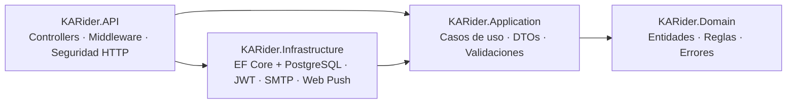
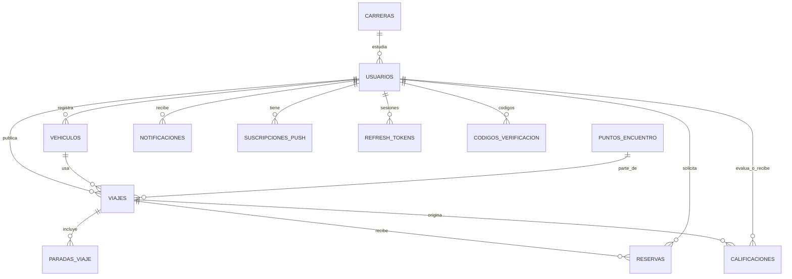

# Arquitectura de KARider API

## Capas (Clean Architecture)

Las dependencias siempre apuntan hacia el centro:

| Proyecto | Responsabilidad | Depende de |
|---|---|---|
| **Domain** | Entidades con comportamiento (`Viaje.ApartarAsientos`, `Reserva.Confirmar`…), máquina de estados, cálculo del aporte, catálogo de errores (`DomainErrors`), patrón `Result`. No tiene paquetes externos. | — |
| **Application** | Un servicio por módulo del MVP, DTOs, validadores FluentValidation y puertos (`IApplicationDbContext`, `IPasswordHasher`, `ITokenService`, `IEmailSender`, `IPushSender`). | Domain |
| **Infrastructure** | Adaptadores: `AppDbContext` (Npgsql, snake_case, migraciones), JWT, PBKDF2, HMAC, SMTP, Web Push (VAPID), health checks. | Application |
| **API** | Controladores delgados, formato de errores, autenticación y autorización, rate limiting, CORS, cabeceras de seguridad, OpenAPI. | Application, Infrastructure |

Los flujos de negocio esperados (sin cupo, duplicados, etc.) se resuelven con `Result`/`Error` y no con excepciones. El `GlobalExceptionHandler` atiende solo los casos excepcionales: concurrencia, base de datos caída y errores no previstos.

## Del documento de requerimientos a la API

| MVP / Pantalla | Endpoints |
|---|---|
| P2 Inicio de sesión | `POST /api/v1/auth/login` (rol opcional, «recordarme» con refresh de 30 días), `refresh`, `logout`, `olvide-contrasena`, `restablecer-contrasena` |
| P3/P4 Registro y verificación institucional | `POST /api/v1/auth/registro` (pasajero, o conductor con vehículo), `verificar-correo`, `reenviar-codigo` |
| P5/P6 Consultar viajes | `GET /api/v1/viajes?destino=&puntoEncuentroId=&fecha=&orden=Horario\|MenorAporte\|Calificacion` (busca también en las paradas; si no hay resultados devuelve `items: []`) |
| P7 Detalle (pasajero) | `GET /api/v1/viajes/{id}` (el teléfono del conductor solo se muestra con reserva confirmada) |
| P7→P8 Apartar asiento | `POST /api/v1/viajes/{id}/reservas` → `POST /api/v1/reservas/{id}/aceptar\|rechazar` (flujo «Gestionar solicitudes» del diagrama) |
| P8 Mapa y reserva confirmada | `GET /api/v1/reservas/{id}` (folio, punto de encuentro), `PUT/GET /api/v1/viajes/{id}/ubicacion` |
| P9/P10 Publicar ruta | `POST /api/v1/viajes` (con `publicar=false` se guarda como borrador), cálculo automático del aporte |
| P11/P12 Detalle conductor / Editar | `GET /api/v1/viajes/{id}` (incluye solicitudes), `PUT /api/v1/viajes/{id}` (notifica a los pasajeros), `PATCH /api/v1/viajes/{id}/estado` |
| Cálculo del aporte | `aporte = gastoTotal / (asientos + 1)` ($160 / (3 + 1) = $40), `GET /api/v1/viajes/{id}/aportes`, `POST /api/v1/reservas/{id}/aporte-pagado` |
| P13 Historial | `GET /api/v1/perfil`, `GET /api/v1/perfil/historial?rol=Todos\|Pasajero\|Conductor` |
| P14 Calificación mutua | `POST /api/v1/calificaciones`, `GET /api/v1/calificaciones/pendientes`, `GET /api/v1/perfil/calificaciones`, `GET /api/v1/usuarios/{id}/calificaciones` |
| P15 Credenciales UTTT | `GET /api/v1/perfil/credenciales`, `GET/POST/PUT/DELETE /api/v1/vehiculos` |
| PWA: notificaciones push | `GET /api/v1/notificaciones`, `GET /api/v1/notificaciones/push/clave-publica`, `POST /api/v1/notificaciones/push/suscripciones` |
| Catálogos | `GET /api/v1/catalogos/carreras`, `puntos-encuentro`, `etiquetas-calificacion` (con caché de 10 minutos) |

## Modelo de datos (PostgreSQL 15)

Reglas aseguradas en la propia base de datos:
- Índices únicos: correo, matrícula, placas activas, folio y calificación por (viaje, evaluador, evaluado).
- Índice único parcial: una sola reserva activa por pasajero en cada viaje.
- `CHECK`: asientos de 1 a 4, estrellas de 1 a 5, cupos que no superan lo ofrecido y gasto mayor a 0.
- Concurrencia optimista con `xmin` en `viajes` y `usuarios`: dos pasajeros no pueden quedarse con el mismo último asiento.

## Escalamiento vertical

| Medida | Dónde |
|---|---|
| GC de servidor y concurrente, Tiered PGO | `KARider.API.csproj` |
| Pool de `DbContext` configurable (`Database__TamanoPoolContextos`) | Infrastructure |
| Pool de conexiones Npgsql (`Maximum Pool Size` en la cadena de conexión) | `.env` / Azure |
| Consultas `AsNoTracking`, proyección directa a DTO, paginación (máximo 50), split queries | Application |
| Índices compuestos para la búsqueda (`estado, fecha_salida`) | Migraciones |
| Output cache de catálogos y compresión Brotli/Gzip | API |
| Límites de Kestrel (cuerpo de 1 MB, timeouts) e hilos mínimos (`Rendimiento__MinWorkerThreads`) | `appsettings.json` |
| Reintentos ante fallas transitorias de la base de datos | `Database__MaxReintentos` |

Para escalar verticalmente en Azure basta con subir el plan de App Service (por ejemplo, de B1 a P1v3 o P2v3) y ajustar `TamanoPoolContextos` y `Maximum Pool Size` según los núcleos del plan y las conexiones que permita PostgreSQL. La API no guarda estado en memoria (JWT y datos en PostgreSQL), así que más adelante también puede escalar horizontalmente. En ese caso, las migraciones deben ejecutarse desde CI y no al iniciar.

## Seguridad

**A nivel de API**
- HTTPS obligatorio con HSTS, encabezados OWASP (CSP, `X-Frame-Options`, `nosniff`, `Referrer-Policy`) y sin encabezado `Server`.
- CORS restringido a los orígenes de la PWA (`Cors__AllowedOrigins__N`) y `AllowedHosts` configurable.
- Rate limiting global (120 solicitudes/min por usuario o IP) y estricto en `/auth` (10/min por IP).
- Cuerpo de solicitud limitado a 1 MB; la compresión se desactiva en `/auth` para mitigar ataques tipo BREACH.
- Política por defecto: todo endpoint exige sesión con correo verificado (`[AllowAnonymous]` explícito para las excepciones).
- Swagger (OpenAPI) solo está habilitado en Development.
- Los secretos se toman solo de variables de entorno, user-secrets o Key Vault, y se validan al iniciar (`ValidateOnStart`).

**A nivel de usuario**
- Registro restringido al dominio `@uttt.edu.mx` y verificación con un código de 6 dígitos de un solo uso (se guarda solo su hash HMAC, con vencimiento y máximo de intentos).
- Contraseñas con PBKDF2 (ASP.NET Identity) y política fuerte (mayúscula, minúscula, número, carácter especial y 8 caracteres como mínimo).
- Bloqueo temporal después de 5 intentos fallidos; respuestas que no revelan si un correo existe.
- Access token JWT de 15 minutos y refresh token rotativo, guardado como hash, con detección de reutilización (si ocurre, se revocan todas las sesiones).
- Cambiar o restablecer la contraseña revoca todas las sesiones.
- Autorización por rol (`Conductor`) y por propiedad del recurso: solo el dueño edita su viaje; solo los participantes ven la ubicación y el teléfono.
- Privacidad: teléfono y placas visibles solo con reserva confirmada.
